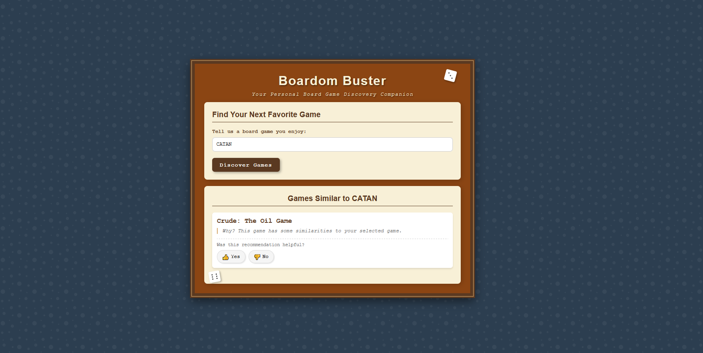

# Boardom Buster - IN DEVELOPMENT

A board game recommendation system powered by BoardGameGeek data and machine learning.

## Overview

Boardom Buster helps users discover new board games based on their current favorites. The system analyzes game features like complexity, player count, play time, and themes to provide personalized recommendations using clustering algorithms and similarity metrics. 

Blog post about it: [click](https://wilowsballoc.bearblog.dev/boardom-buster-my-boardgame-recommendation-system/)


*Boardom Buster's recommendation interface*

## Features

- Personalized board game recommendations based on games you enjoy
- Smart filtering based on multiple game attributes
- Clustering-based recommendations for better accuracy 
- User feedback collection for continuous improvement
- Simple and intuitive web interface
- Auto-updating game database via BGG API

## Tech Stack

- **Backend**: Python, Flask
- **Frontend**: HTML, CSS, JavaScript
- **Data Processing**: Polars, NumPy
- **Machine Learning**: scikit-learn
- **Data Source**: BoardGameGeek XML API 2.0
- **Storage**: Parquet and CSV

## Project Structure

```
boardom_buster/
├── run.py                          # Main application entry point, contains Flask server setup
├── feedback/                       # Directory for storing user feedback data
│   └── user_feedback.csv           # CSV file containing user interaction feedback
└── src/                            # Source code directory
    ├── __init__.py                 # Python package initialization
    ├── bgg/                        # BoardGameGeek API interaction module
    │   ├── __init__.py             # Package initialization
    │   ├── bgg_control.json        # API control
    │   ├── bgg.py                  # BGG API interaction implementation
    │   ├── configs.py              # BGG module specific configurations
    │   ├── logger.py               # Logging functionality for BGG operations
    │   ├── data/                   # Storage for BGG raw data
    ├── data_processing/            # Data preprocessing module
    │   ├── __init__.py             # Package initialization
    │   ├── configs.py              # Data processing configurations
    │   ├── data_prep.py            # Data preparation and cleaning scripts
    │   └── processed_data/         # Storage for processed dataset files
    ├── model/                      # Machine learning model module
    │   ├── __init__.py             # Package initialization
    │   ├── binning_input_games.py  # (Unused) Game categorization logic
    │   ├── cluster_games.py        # Game clustering implementation
    │   ├── configs.py              # Model specific configurations
    │   ├── recommend_games.py      # Game recommendation engine
    │   ├── utils.py                # Utility functions for the model
    │   └── clustering_results/     # Storage for model outputs
    │       └── cluster/            # Generated cluster
    ├── static/                     # Web application static assets
    │   ├── script.js               # Frontend JavaScript code
    │   └── style.css               # CSS styling
    └── templates/                  # Web application templates
        └── index.html              # Main webpage template
```

## Setup and Installation

*Coming soon*

## Usage

*Coming soon*

## To do (from 2025-05-05 onwards):

- [ ] Add logging for the data_processing modul + error handling.
- [ ] Add logging for the model module + error handling.
- [ ] Refactor all the plotting being done on the model module.
- [ ] Improve scoring metrics (this requires studying).
- [ ] Refactor distance matrix calculation.
    - [X] Refactor.
    - [ ] Cache the results.
    - [X] Distance matrix for each cluster.
    - [ ] Vectorization (?).
- [ ] Add/Work with board games expansions/variations.
- [ ] Cache cluster lookups (?). *
- [ ] Cache previous recommendations. *
- [ ] Accept more than 1 game as input. 
- [ ] Improve UI (this requires a sacrificing ritual).
- [X] Add reqs. file.
- [ ] Save the ID before the 50 fails, not the ID after.

* Ideally I could pre compute everything, every single recommendation. Should I do it? What about multi-input?

## Acknowledgments

- [BoardGameGeek](https://boardgamegeek.com/) for providing the game data API.

## Disclaimer

This project is not affiliated with BoardGameGeek. All game data is sourced from the publicly available BGG API.